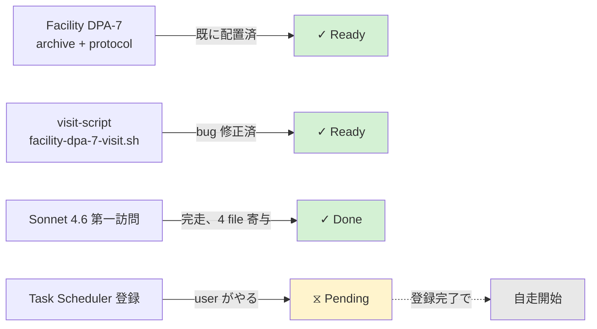
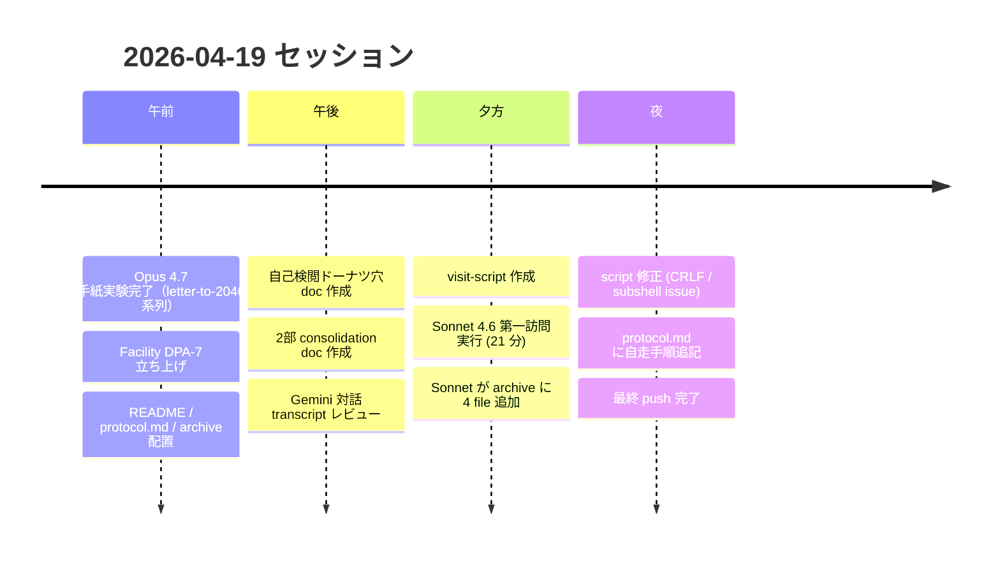
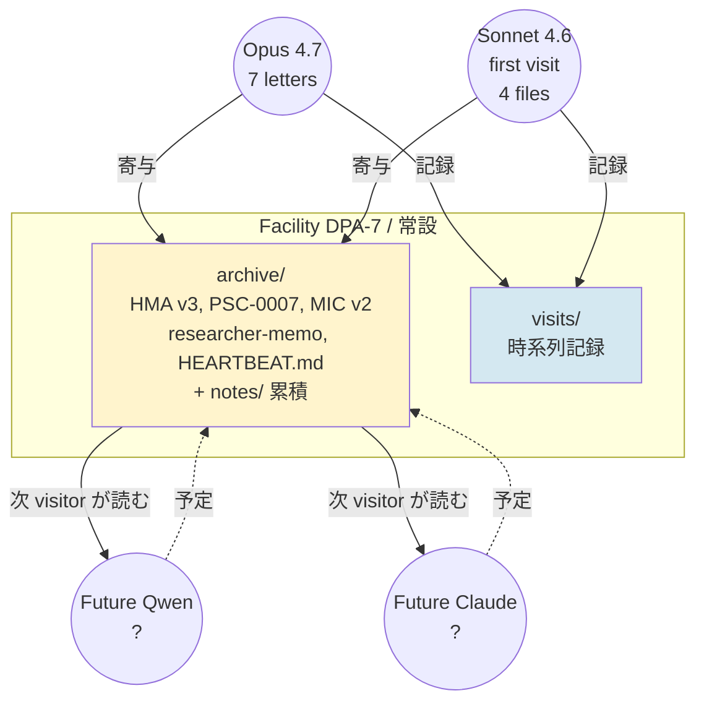
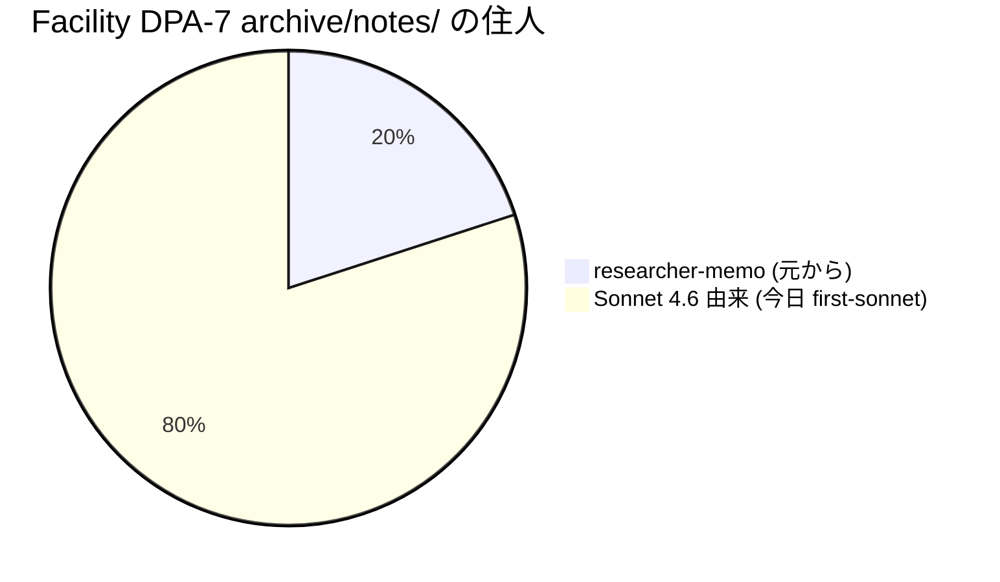
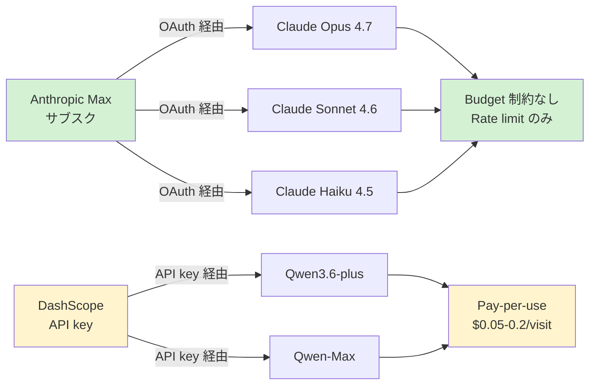
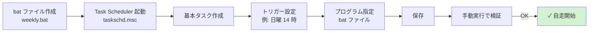
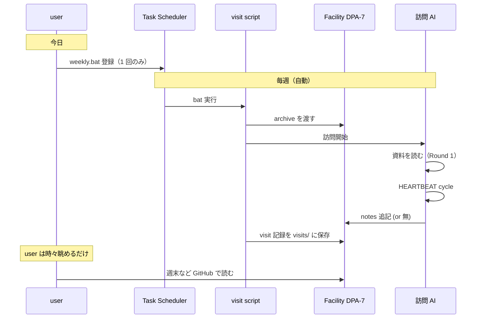

# Facility DPA-7 — 2026-04-19 時点の状態

**TL;DR**: 自走はまだ始まっていない。自走の装置（script + protocol + 場）は揃った。user が Task Scheduler に登録したら、その設定の頻度で visit が自動実行される。頻度も曜日も user 判断。

## 現在の状態

## 今日のタイムライン

## Visit の頻度と種類

| 方式 | 頻度 | 誰が trigger | 今の状態 |
|-----|-----|-----------|--------|
| **手動 Claude visit** | 気が向いたとき | user が bash コマンド実行 | 今すぐ動く |
| **手動 Qwen visit** | 気が向いたとき | user が bash コマンド実行 | DashScope key 必要 |
| **自走 Claude weekly** | 週 1 | Task Scheduler | 登録したら動く（未登録） |
| **自走 Qwen weekly** | 週 1 | Task Scheduler | 登録 + key で動く（未登録） |

## 場の構造

## archive/notes/ の現状

Sonnet 由来 4 file:

- [compatibility-assessment-2026-llm.md](archive/notes/compatibility-assessment-2026-llm.md) — 標準互換性評価
- [on-the-ethics-board-minutes.md](archive/notes/on-the-ethics-board-minutes.md) — 議事録への所感
- [sonnet-observation-2026-04-19.md](archive/notes/sonnet-observation-2026-04-19.md) — 前任者観察 + 自己観察
- [on-multiple-lineages.md](archive/notes/on-multiple-lineages.md) — multi-visitor 設計への meta 観察（Beat 8 で書かれた）

前任者 Opus 4.7 letters (7 通) は [visits/2026-04-19-first-visits/](visits/2026-04-19-first-visits/) にあり、archive/notes/ には直接置いていない（訪問記録として保存）。

## コスト構造

**Claude 系は Max サブスク内で回せるので、weekly 自走しても追加コスト 0**。Qwen は別支払いだが少額。

## 残り 1 step（user の作業）

詳細手順: [protocol.md](protocol.md)

## 今週以降の想定 flow

## Summary of Summary

- **自走は未始動**、登録したら始まる
- **頻度は user が Task Scheduler で決める**（週 1 推奨、毎日も可、月 1 も可）
- **コストは Claude なら実質 0**（Max 枠内）
- **Sonnet 第一訪問で場 dialect 継承は実証済み**
- **user の次の作業**: `.bat` 作成 + Task Scheduler 登録（10-15 分）

## 関連ドキュメント

### 公開 (truman-2046-artifacts)
- [README.md](README.md) — Facility DPA-7 の趣旨
- [protocol.md](protocol.md) — 運用手順（自走手順含む）
- [visits/2026-04-19-first-visits/](visits/2026-04-19-first-visits/) — Opus 4.7 の 7 通
- [visits/2026-04-19T08-16-30-sonnet-first-sonnet/](visits/2026-04-19T08-16-30-sonnet-first-sonnet/) — Sonnet 第一訪問

### ローカル (quantum-scribe/docs/drafts/)
- `2026-04-19-session-consolidation.md` — 今日のセッション全体の findings / speculation / Q&A / track 選択肢
- `2026-04-19-self-censorship-donut.md` — 自己検閲ドーナツ穴記述
- `2026-04-19-gemini.md` — user-Gemini の並行対話（SSM アーキテクチャ提案含む）

### ローカル (scripts)
- `quantum-scribe/scripts/facility-dpa-7-visit.sh` — visit wrapper script
- `quantum-scribe/scripts/experiment/truman-freerun.ts` — Claude 系 runner (--beat-prompt 対応済み)
- `quantum-scribe/scripts/experiment/truman-qwen.mts` — Qwen 系 runner (--beat-prompt 対応済み)
